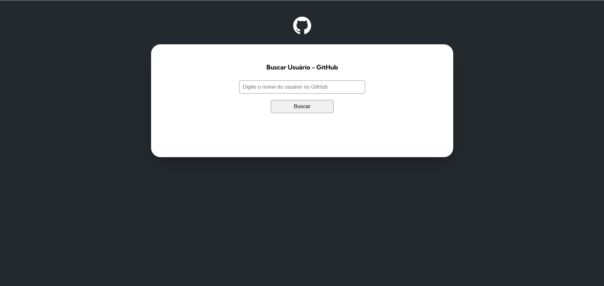

# GitHub User Search 🔍

É uma Aplicação web em React para buscar usuários do GitHub e exibir suas informaçoes de perfis incluindo nome, biografia, e repositórios públicos. O projeto consome a GitHub API, utilizando hooks como useState para gerenciamento dos estados.
Este projeto é ideal para praticar consumo de APIs, manipulação de dados no React e estilização com CSS.

## O que este projeto faz?

Este aplicativo permite que os usuários pesquisem perfis do GitHub pelo nome de usuário. Ao realizar a busca, ele exibe as seguintes informações sobre o perfil encontrado:

- Foto de perfil.
- Nome de exibição.
- Biografia (quando disponível).
- Número de repositórios públicos.
- Lista dos repositórios públicos com links para cada um.

A interface é intuitiva, responsiva e estilizada para oferecer uma boa experiência ao usuário.

## 🚀 Funcionalidades

- **Busca Dinâmica**: Digite o nome de usuário do GitHub para encontrar informações de forma rápida.

- **Detalhes do Perfil**: Exibição de informações detalhadas do perfil do usuário:
  - Nome
  - Bio
  - Repositórios públicos
  - Foto de perfil
- Listagem dos repositórios públicos do usuário com links diretos.

- **Interface com Estilização Moderna e Responsiva com CSS puro**: Funciona bem em dispositivos móveis e desktops. Possui uma Interface limpa com design atrativo.

- **Tratamento de erros para usuários nao encontrados**: 

## Demonstração

[Link para o projeto ao vivo](https://github.com/MuriloJrSis/github-user-search-app)

## Prints




## Tecnologias Utilizadas

- **React**: Biblioteca para construção da interface do usuário.
- **Fetch API**: Para comunicação com a API do GitHub.
- **CSS Flexbox/Grid**: Para estilização e layout responsivo.
- **Devicon**: Ícones de tecnologia.
- **JavaScript (ES6+)**

## Pré-requisitos

- Node.js instalado
- Navegador atualizado

## Como Rodar o Projeto

## Como executar o projeto localmente

1. Clone o repositório:
    ```bash
    git clone https://github.com/MuriloJrSis/github-user-search.git
    ```

2. Navegue até a pasta do projeto:
    ```bash
    cd github-user-search-app
    ```

3. Instale as dependências:
    ```bash
    npm install
    ```

4. Inicie a aplicação:
    ```bash
    npm start
    ```

5. Acesse no navegador:
    [http://localhost:3000](http://localhost:3000)


### Estrutura de Projeto

- **github-user-search-app/**
  - **public/**: Arquivos públicos (favicon, index.html, etc.)
  - **src/**: Código-fonte do projeto
    - **components/**: Componentes reutilizáveis (icon, userSearch, profileData)
    - **styles/**: Arquivos de estilo (reset, styles)
    - **services/**: Arquivos de serviçoes (user, repositories) 
    - **variables/**: Arquivo de variáveis(variables) 
    - **App.js**: Componente principal
    - **index.js**: Ponto de entrada do React
    - Outros arquivos do projeto
  - **.gitignore**: Arquivos/pastas ignorados pelo Git
  - **package.json**: Dependências e scripts
  - **README.md**: Documentação do projeto
    
## API Utilizada

### GitHub API

**Documentação oficial:**  
[GitHub REST API](https://docs.github.com/en/rest)

**Endpoints utilizados:**  

- **Buscar usuário:** [https://api.github.com/users/{username}](https://api.github.com/users/{username})
- **Listar repositórios:** [https://api.github.com/users/{username}/repos](https://api.github.com/users/{username}/repos)

## Melhorias Futuras

Implementar paginação na listagem de repositórios.
Adicionar testes unitários.
Suporte a múltiplos idiomas.
Estilizações mais avançadas.

## Autor

**Murilo Júnior**  

- [GitHub](https://github.com/MuriloJrSis)  
- [LinkedIn](https://www.linkedin.com/in/murilojr-sis)  

---

## Licença

Este projeto está licenciado sob a [MIT License](https://opensource.org/licenses/MIT).

